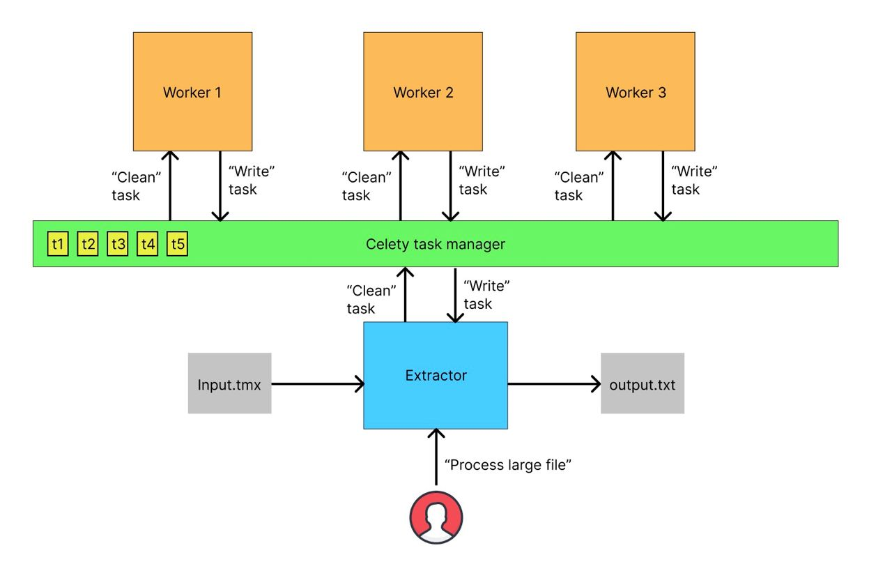

# Scalable ETL pipeline for tmx files

This system extracts parallel sentences in 2 languages from a tmx file, cleans, deletes inappropriate translations and writes the result to a file.

## Get started

Define env WORKERS
```
export WORKERS=3
```
Run service
```
make deploy
```
Submit your file
```
./run.sh resources/tmx-file.tmx resources/output.txt
```


## Architecture



- The Extractor iterates through the tmx file and sends multuple tasks to celery
- Worker X takes the cleaning task, filters sentences and sends the alignment task to celery
- Worker Y takes the alignment task, runs the alignment model, and sends the write task to celery
- The Extractor takes the write task and writes the sentences to the output file

## Next steps

It is better to transfer the alignment model to another service using Triton in order to use batching.
In addition, the model adds a lot of dependencies to the worker, which is not very nice. 